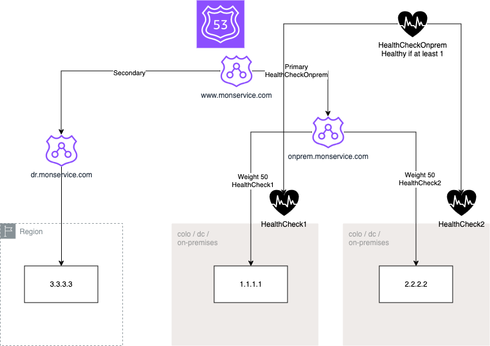

# AWS Route53 Disaster Recovery DNS Solution



This project uses Terraform to create a test environment and implement a Disaster Recovery (DR) DNS solution using AWS Route53. It sets up a primary environment and a DR environment, with automatic failover capabilities.

## Table of Contents

- [Prerequisites](#prerequisites)
- [Installation](#installation)
- [Usage](#usage)
- [Architecture](#architecture)
- [Testing](#testing)
- [Contributing](#contributing)
- [License](#license)

## Prerequisites

- AWS Account
- Terraform (version 0.12 or later)
- AWS CLI configured with appropriate credentials

## Installation

1. Clone the repository:
```
git clone https://github.com/your-username/route53-dr-solution.git
```

2. Navigate to the project directory:

```
cd Route53DR
```

3. Initialize Terraform:

```
terraform init
```

## Usage

1. Review and modify the `variables.tf` file to set your desired configuration.

2. Plan the Terraform execution:

```
terraform plan
```

3. Apply the Terraform configuration:

``` 
terraform apply 
```

4. When prompted, type `yes` to proceed with the creation of resources.

## Architecture

This solution creates the following components:

- EC2 instances for the primary and DR environments
- Route53 health checks for monitoring the primary environment
- Route53 DNS records with failover routing policy
- Necessary security groups and IAM roles

The primary environment consists of two EC2 instances, while the DR environment has one EC2 instance. Route53 is configured to automatically failover to the DR environment if the primary environment becomes unavailable.

## Testing

To test the failover mechanism:

1. Access the primary environment using the provided DNS name.
2. Simulate a failure in the primary environment (e.g., stop the EC2 instances).
3. Observe that traffic is automatically routed to the DR environment.

You can use the following command to continuously test the endpoint:

```
watch -n1 curl -s --connect-timeout 1 www.service.com
```

Replace `www.service.com` with your actual domain name.

## Contributing

Contributions are welcome! Please feel free to submit a Pull Request.

## License

This project is licensed under the MIT License - see the [LICENSE](LICENSE) file for deta